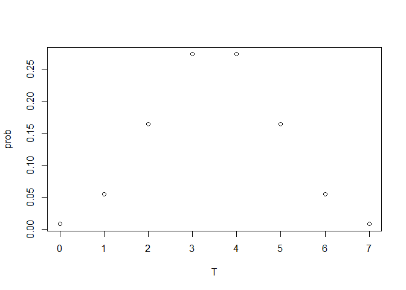

# ノンパラメトリック検定

## 符号検定

中央値がある値m_0に等しいかどうかを検定すること.

$H_0: m = m_0$
$H_1: m > m_0 \space (片側検定) \space or \space m \neq m_0 \space(両側検定)$

母集団から抽出した標本：$X_1, \dots, X_n$

検定統計量T：$T=\sum{I(X_i > m_0)}, \space T \sim Bin(n, \frac{1}{2})$


``` r
> # n=7
> # the pmf plot
> dbinom(0:7,7,0.5)
FALSE [1] 0.0078125 0.0546875 0.1640625 0.2734375 0.2734375 0.1640625 0.0546875
FALSE [8] 0.0078125
```

``` r
> plot(0:7, dbinom(0:7,7,0.5),ylab = "prob", xlab="T")
```

<!-- -->

``` r
> # alpha=0.05, one side
> qbinom(0.05,7,0.5,lower.tail = F)
FALSE [1] 6
```

## 符号付き順位検定

検定統計量T：$T=\sum{i *I(X_i > 0)}, I \sim Ber(1/2)$
$E(iI)=i*1/2, V(iI)=i^2*1/4, E(T)=1/2\sum{i}=\frac{(1+n)n}{4}, v(T)=1/4 \sum{i^2}=\frac{n(n+1)(2n+1)}{6*4}$


``` r
> # n=7(sequence)
```

